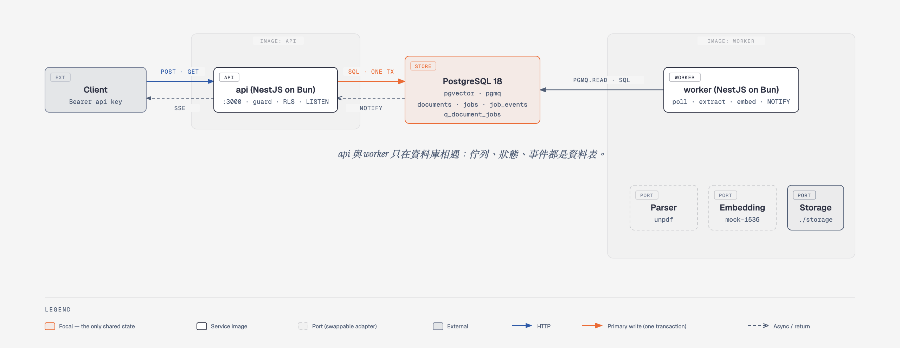
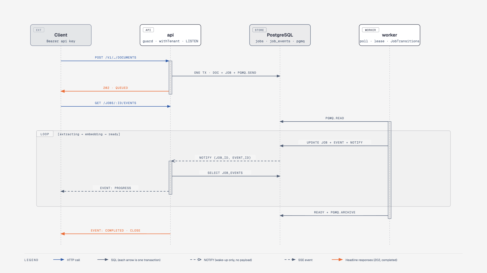

# doc-ingest

Multi-tenant (多租戶) 教材匯入服務：這邊是設計用自己的 API key 把教材 `POST` 進 workspace，待前後端串接完成後，可帶入類似 JWT 的機制對教師進行身分與租戶驗證 (identity & tenant)，服務立刻回 `202`，背景 worker 完成「文字抽取 → 建立向量 → 完成」，過程中可以查狀態、也可以用 SSE 即時看進度。

設計規格是 `docs/DESIGN.md`，每個決定與理由在 `docs/DECISIONS.md`（D-01 ～ D-26）；本文只摘要。



三個容器：`api`、`worker`、`db`。api 與 worker 是同一個 repo、同一份 `Dockerfile` 的兩個 target，共用 `src/shared/`。api → worker 靠 pgmq（純 SQL 佇列，與業務寫入同交易）；worker → api 靠 PostgreSQL `LISTEN/NOTIFY`（通知只當叫醒鈴，內容以資料表為準）。

## 目錄

1. [快速啟動](#1-快速啟動)
2. [技術棧](#2-技術棧)
3. [認證與 seed key](#3-認證與-seed-key)
4. [API 摘要](#4-api-摘要)
5. [測試與驗證](#5-測試與驗證)
6. [架構決策](#6-架構決策摘要完整版見-docsdecisionsmd)
7. [資安設計](#7-資安設計)
8. [已知限制](#8-已知限制)
9. [正式環境延伸](#9-正式環境延伸)
10. [後續延伸的端點](#10-後續延伸的端點本次刻意不做d-16)
11. [專案結構與環境變數](#11-專案結構與環境變數)

## 1. 快速啟動

需求：Bun ≥ 1.4、PostgreSQL 18 + pgvector（本機 Homebrew 或容器）、Podman 或 Docker（可選）。

### 本機（Homebrew PostgreSQL）

```bash
brew install postgresql@18 pgvector && brew services start postgresql@18
createdb doc_ingest
bun install
cp .env.example .env            # 本機預設值已可直接用
bun run migrate                 # 建角色、pgvector、pgmq、六張表、RLS
bun run seed                    # 兩個 workspace、兩把 API key、各一份 ready 的範例 PDF
bun run dev                     # api（:3000）與 worker 一起起來，含熱重載
```

pgmq 不需要另外安裝：`migrations/pgmq/pgmq.sql` 已內附，由 `bun run migrate` 灌進去（D-23）。

### 容器（podman compose）

```bash
./scripts/compose-demo.sh       # 起 db / api / worker、對容器 db migrate + seed、POST 一份文件、等 worker 做到 ready
podman compose down             # 關掉（volume 保留）
```

`docker compose` 也能讀同一份 `docker-compose.yml`；容器 db 對外是 port **5433**，避免跟本機的 5432 打架。macOS 上若 `podman compose` 卡在鑰匙圈視窗，先用 `podman build --target api`、`--target worker` 與 `podman pull` 準備好映像，再 `podman compose up -d --no-build`。

### 檢查

```bash
bun test                        # 83 個 e2e + unit，打 .env 指定的資料庫，每個測試前清空租戶表
bun run lint && bun run fmt:check && bun run typecheck
```

## 2. 技術棧

| 層 | 選擇 | 為什麼（完整理由見 `docs/DESIGN.md` §1、`docs/DECISIONS.md`） |
|---|---|---|
| Runtime | **Bun 1.4** | 一個工具鏈包含執行、安裝、測試；內建 `SQL` 客戶端與 `sql.listen`，不用另外裝 `pg` |
| 框架 | **NestJS 12**（Express adapter） | 模組 / DI / Guard / Interceptor / Filter 的心智模型；SSE 不用 `@Sse()`，直接寫 raw `Response`（D-05） |
| 語言 | TypeScript 6（strict） | `@/*` 路徑別名指向 `src/` |
| 驗證 + API 文件 | **Zod 4 + nestjs-zod + @nestjs/swagger** | 同一份 Zod schema 同時做請求驗證、回應序列化與 OpenAPI（D-17）；不用 class-validator |
| 資料庫 | **PostgreSQL 18 + pgvector + pgmq** | 一個 DB 同時是資料、佇列、通知匯流排；pgmq 以 SQL 檔安裝，不依賴擴充套件（D-23） |
| 資料存取 | Bun `SQL` + 手寫 SQL，**不用 ORM**（D-02） | 每張表一個 repository、每個方法第一參數是 `workspaceId`；遷移是 `migrations/NNN_name.sql` + 30 行 `scripts/migrate.ts` |
| 佇列 | **pgmq** | 純 SQL 函式，`pgmq.send` 與 `INSERT documents / jobs` 同一交易（D-03、D-12） |
| 即時 | PostgreSQL **LISTEN / NOTIFY** | worker `pg_notify` → api `sql.listen` → SSE；不用 Redis pub/sub（D-04） |
| 日誌 | **pino**（nestjs-pino） | 結構化 JSON、內建 redaction；本機 `LOG_PRETTY=true` 用 pino-pretty |
| HTTP 防護 | helmet、body 大小上限 | body parser 層就擋 `MAX_DOCUMENT_BYTES + 64 KB` |
| PDF 解析 | **unpdf** | 純 TypeScript，Bun 可跑；text / markdown 直接 UTF-8 解碼 |
| Embedding | mock（sha256 → 1536 維單位向量） | `EmbeddingPort` 介面已在，正式環境換實作即可（D-15） |
| ID | ulid，帶前綴 `ws_` / `doc_` / `job_` / `req_` / `chk_` | 可排序、看得出型別 |
| 測試 | **`bun test` + supertest** | e2e 打真實 PostgreSQL，不 mock DB |
| Lint / Format | **oxlint**（type-aware）/ **oxfmt** | oxc 系列，Rust 寫的，快（D-18） |
| 容器 | Podman compose（Docker 相容）、一份 `Dockerfile` 兩個 target | `api` / `worker` 兩個映像共用 `src/shared/`（D-06） |

## 3. 認證與 seed key

一把 API key = 一個 workspace 的完整權限（D-08）。請求帶 `Authorization: Bearer <key>`；資料庫只存 SHA-256，`revoked_at` 設了就失效。

| workspace | 名稱 | 本機 seed key（`.env.example`，僅供本機） |
|---|---|---|
| `ws_alpha` | Alpha 國中 | `dk_alpha_local_only` |
| `ws_beta` | Beta 高中 | `dk_beta_local_only` |

用另一個 workspace 的 key 讀資源，回應與「不存在」**逐位元相同**：`404 NOT_FOUND`，刻意不回 403（D-09）。

## 4. API 摘要

Swagger UI：http://localhost:3000/docs ，OpenAPI JSON：`/docs-json`。所有回應都帶 `X-Request-Id` 標頭與 `request_id` 欄位（客戶端可自帶 ULID 格式的 `X-Request-Id`，會原樣回傳）。

| Method | Path | 說明 |
|---|---|---|
| POST | `/v1/workspaces/:workspaceId/documents` | 建立文件處理任務，回 `202`；`Idempotency-Key` 必填 |
| GET | `/v1/documents/:documentId` | metadata + 最新 job 摘要 + 處理結果摘要（`text_preview`、embedding 模型） |
| GET | `/v1/jobs/:jobId` | 狀態、進度、attempt、`retries_used`、`last_error` |
| GET | `/v1/jobs/:jobId/events` | SSE：`snapshot` → 補發（帶 `Last-Event-ID`）→ 即時；終止後關閉 |
| GET | `/health`、`/ready` | liveness；readiness 檢查 DB 與 pgmq 佇列 |

下面四段各對應一個端點，每段都是「curl → 實際回應」。`<job_id>`、`<document_id>` 換成第一步回來的值。

### 4.1 建立文件 `POST /v1/workspaces/:workspaceId/documents`

Body 欄位：`name`、`mime_type`（`application/pdf` / `text/plain` / `text/markdown`）、`size_bytes`、內容二擇一 `content_text`（直接貼文字）或 `storage_key`（`./storage/` 下已存在的檔案，第一段必須是自己的 workspace），`metadata`（可選，序列化 ≤ 4 KB）。

```bash
curl -s -X POST http://localhost:3000/v1/workspaces/ws_alpha/documents \
  -H 'Authorization: Bearer dk_alpha_local_only' \
  -H 'Idempotency-Key: demo-1' \
  -H 'Content-Type: application/json' \
  -d '{"name":"unit-3.txt","mime_type":"text/plain","size_bytes":11,"content_text":"hello world","metadata":{"grade":5}}'
```

```json
{ "document_id": "doc_01K4…", "job_id": "job_01K4…", "status": "queued", "request_id": "req_01K4…" }
```

同一把 key、同一個 `Idempotency-Key`、同樣 body 再送一次 → 同樣的 `202` 與同樣的 id，多一個標頭 `Idempotent-Replayed: true`；同 key 不同 body → `409 IDEMPOTENCY_KEY_REUSED`。PDF 範例（seed 已放好檔案）：

```bash
-d '{"name":"unit-3-fractions.pdf","mime_type":"application/pdf","size_bytes":877,"storage_key":"ws_alpha/samples/unit-3-fractions.pdf"}'
```

### 4.2 查 job `GET /v1/jobs/:jobId`

```bash
curl -s -H 'Authorization: Bearer dk_alpha_local_only' http://localhost:3000/v1/jobs/<job_id>
```

```json
{
  "id": "job_01K4…", "workspace_id": "ws_alpha", "document_id": "doc_01K4…", "kind": "ingest",
  "status": "ready", "progress": 100,
  "attempt": 1, "max_attempts": 3, "retries_used": 0,
  "last_error": null,
  "started_at": "2026-09-06T02:10:01.120Z", "finished_at": "2026-09-06T02:10:03.004Z",
  "created_at": "…", "updated_at": "…", "request_id": "req_01K4…"
}
```

`status` 是 `queued → extracting → embedding → ready | failed`；`retries_used = attempt − 1`；失敗時 `last_error` 是 `{ "code": "EMBEDDING_PROVIDER_ERROR", "message": "…" }`，訊息已去除堆疊、路徑與金鑰樣式字串。

### 4.3 SSE 進度 `GET /v1/jobs/:jobId/events`

```bash
curl -N -H 'Authorization: Bearer dk_alpha_local_only' http://localhost:3000/v1/jobs/<job_id>/events
```

```
event: snapshot
data: {"job_id":"job_01K4…","status":"queued","progress":0,"attempt":0,"last_error":null,"at":"…"}

id: 41
event: stage_changed
data: {"job_id":"job_01K4…","stage":"extracting","progress":10,"attempt":1,"at":"…"}

id: 42
event: progress
data: {"job_id":"job_01K4…","stage":"extracting","progress":40,"attempt":1,"page_count":null,"content_length":11,"at":"…"}

id: 43
event: stage_changed
data: {"job_id":"job_01K4…","stage":"embedding","progress":40,"attempt":1,"at":"…"}

id: 44
event: progress
data: {"job_id":"job_01K4…","stage":"embedding","progress":90,"attempt":1,"chunks_done":1,"chunks_total":1,"at":"…"}

: ping

id: 45
event: completed
data: {"job_id":"job_01K4…","stage":null,"progress":100,"attempt":1,"chunk_count":1,"status":"ready","at":"…"}
```

- `snapshot` 沒有 `id`，是連線當下 `jobs` 表的現況；之後每個事件的 `id:` 就是 `job_events.id`。
- 斷線後帶 `Last-Event-ID: 42` 重連，會先給 `snapshot`，再只補 43 之後的事件，不重複。
- 失敗路徑的事件是 `retry_scheduled`（帶 `code`、`next_in_sec`）× 2，最後 `failed`（帶 `code`、`reason: MAX_ATTEMPTS_EXCEEDED`）。
- 收到 `completed` 或 `failed` 後伺服器主動關閉；每 15 秒一行 `: ping` 保活。
- job 不存在或屬於別的 workspace：回一般的 `404` JSON，不會開串流。

### 4.4 查文件 `GET /v1/documents/:documentId`

```bash
curl -s -H 'Authorization: Bearer dk_alpha_local_only' http://localhost:3000/v1/documents/<document_id>
```

```json
{
  "id": "doc_01K4…", "workspace_id": "ws_alpha",
  "name": "unit-3.txt", "mime_type": "text/plain", "size_bytes": 11,
  "status": "ready", "page_count": null, "chunk_count": 1,
  "metadata": { "grade": 5 },
  "latest_job": { "id": "job_01K4…", "status": "ready", "progress": 100, "attempt": 1, "finished_at": "…" },
  "result": { "text_preview": "hello world", "embedding_model": "mock-1536", "embedding_dimensions": 1536 },
  "created_at": "…", "updated_at": "…", "request_id": "req_01K4…"
}
```

`result` 只在 `status = ready` 時有值（`text_preview` 最多 500 字）；`status` 是 `pending → processing → ready | failed`。

### 4.5 錯誤格式

錯誤一律是 `{ "error": { "code", "message", "request_id", "details?" } }`，`code` 見 `docs/DESIGN.md` §6.3：

| HTTP | `code` | 什麼時候 |
|---|---|---|
| 400 | `VALIDATION_ERROR` | 缺欄位、型別錯、`metadata` > 4 KB、body 不是 JSON；`details[]` 列出每個欄位 |
| 400 | `IDEMPOTENCY_KEY_REQUIRED` | POST 沒帶 `Idempotency-Key` |
| 400 | `CONTENT_SOURCE_INVALID` | `content_text` 與 `storage_key` 兩個都給或都沒給 |
| 400 | `INVALID_STORAGE_KEY` | 含 `..`、以 `/` 開頭、反斜線、非法字元、前綴不是自己的 workspace |
| 401 | `UNAUTHORIZED` | 缺 / 格式錯 / 未知 / 已撤銷的 key |
| 404 | `NOT_FOUND` | 不存在**或**屬於其他 workspace（含 `:workspaceId` 路徑不符），body 相同 |
| 409 | `IDEMPOTENCY_KEY_REUSED` | 同 key 不同 body |
| 413 | `DOCUMENT_TOO_LARGE` | `size_bytes` 或 body 超過 10 MB |
| 415 | `UNSUPPORTED_MEDIA_TYPE` | MIME 不在白名單 |
| 422 | `SIZE_MISMATCH` | `size_bytes` 與實際內容差超過 5 % |
| 500 | `INTERNAL_ERROR` | 未預期例外，對外固定 "Unexpected error."，細節只進 log |
| 503 | `NOT_READY` | `/ready` 連不到 DB 或佇列不存在 |

```json
{ "error": { "code": "VALIDATION_ERROR", "message": "Request validation failed.", "request_id": "req_01K4…",
             "details": [ { "field": "name", "issue": "Invalid input: expected string, received undefined" } ] } }
```

測試用的失敗注入（`FAILURE_INJECTION=true` 時）：在 `content_text` 或檔名放 `[[FAIL_EXTRACT]]`、`[[FAIL_EMBED_ONCE]]`、`[[FAIL_EMBED]]`、`[[SLOW]]`。

## 5. 測試與驗證

三種方式互補：`bun test` 是自動化基準；`scripts/*.sh` 是能對著跑中的服務重現主流程的腳本；Postman 給不想看 shell 的人。

### 5.1 `bun test`：83 個測試

前置：`.env` 的 `DATABASE_URL_ADMIN` 指向一個跑過 `bun run migrate && bun run seed` 的 DB。每個測試前 `truncate` 五張租戶表並清空 pgmq 佇列，所以測試之間互不干擾；worker 不跑背景迴圈，測試自己呼叫 `pollOnce()` 決定何時處理。

**e2e（`test/e2e/`，透過 supertest 打真的 Nest app，對真的 PostgreSQL）**

| 檔案 | 驗證什麼 | 例子 |
|---|---|---|
| `documents.e2e.test.ts` | POST 的完整規格：202 回應與 DB / 佇列各有一列、`X-Request-Id` 回傳、§6.3 每個錯誤碼、auth 與租戶路徑、冪等 | 「10 個一模一樣的併發請求 → 只有一個 document」；「同 key 不同 body → 409」；「body 內 key 順序不同 → hash 相同」 |
| `worker.e2e.test.ts` | worker 三階段與冪等：文字與 PDF 都到 ready、chunks / 事件 / 歸檔表正確；重試不重抽、不重複 chunk | 「`[[FAIL_EMBED_ONCE]]` → attempt 2 成功，parser 只被叫一次，chunks 無重複」；「`[[FAIL_EMBED]]` → attempt 3 failed，`last_error` 無路徑 / 堆疊」；「已完成的 job 被重複投遞 → 直接歸檔不改資料」 |
| `worker-lease.e2e.test.ts` | 兩輪 security audit 的修正：處理中續租約、單次 attempt 逾時、slot 各自補位 | 「一個 3 秒的 job 在 vt = 2 秒下不會被領第二次（`read_ct` = 1）」；「慢 job 還在跑時，空出的 slot 馬上領下一則」 |
| `query.e2e.test.ts` | 兩個 GET 的回應形狀與狀態機：`pending` 時 `result: null`、ready 後有 `text_preview`、PDF 有 `page_count` | 「`text_preview` 最多 500 字」；「別的 workspace 的 key 與不存在的 id 拿到相同 404 body」 |
| `sse.e2e.test.ts` | SSE 順序規則：snapshot → stage/progress → completed 關閉；`Last-Event-ID` 補發不重複；終止 job 直接關 | 「帶第 2 個事件的 id 重連，只收到第 3 個之後」；「failed job：兩個 `retry_scheduled` 然後 `failed`」；「跨租戶：404 JSON、沒有串流」 |
| `rls.e2e.test.ts` | 第二道防線真的擋：直接用 `app_user` 下 SQL | 「不帶 WHERE 的 `SELECT` 在沒 `set_config` 時是空的、設了只看到該租戶」；「在 alpha 的交易內 INSERT 一列 beta 的資料 → 被 policy 擋」；「五張表都 `ENABLE + FORCE`」 |
| `health.e2e.test.ts` | `/health` 與 `/ready` 的差別 | 「DB 連不到時 `/ready` 503 `NOT_READY`，`/health` 仍 200」 |
| `logging.e2e.test.ts` | 日誌遮罩（spawn 一個真的 api、`LOG_FILE` 寫檔再讀） | 「POST 一份含 API key 與內容的文件後，log 檔裡找不到 `content_text` 內容、原始 key，`authorization` 是 `[Redacted]`」 |

**unit（`test/unit/`，純函式與 adapter，不碰 DB）**

| 檔案 | 驗證什麼 | 例子 |
|---|---|---|
| `canonical-json.test.ts` | 冪等 hash 的正規化 | 「物件 key 遞迴排序、陣列保序、`undefined` 欄位不影響 hash」 |
| `documents.validation.test.ts` | §6.4 每條規則對應到自己的錯誤碼 | 「`name` 去掉路徑分隔符」；「錯 MIME → `UNSUPPORTED_MEDIA_TYPE`，不是 `VALIDATION_ERROR`」 |
| `storage-key.test.ts` | `storage_key` 白名單 | 「`ws_alpha/../etc/passwd`、`/abs`、`a\\b`、`ws_beta/x` 全部拒絕」 |
| `local-fs.storage.test.ts` | 檔案系統 adapter 的路徑封鎖 | 「解析後跑出 `STORAGE_ROOT` 的 key 直接拒絕，不讀檔」 |
| `sanitize-error.test.ts` | 進 `jobs.last_error_message` 前的清洗 | 「只留第一行、去掉 `Bearer …`、`sk-…`、URL query、絕對路徑，長度上限」 |
| `fixed-window.chunker.test.ts` | D-26 切分規則 | 「視窗後半段優先在段落邊界切」；「沒有分隔符就硬切並重疊 200 字」；「CJK 一字一 token」 |
| `mock.embedding.test.ts` | mock 向量的性質 | 「同內容同向量、不同內容不同向量、長度為 1」 |
| `unpdf.parser.test.ts` | 解析器邊界 | 「不是 `%PDF-` 開頭 → `EXTRACTION_FAILED`」；「無效 UTF-8 的 text/plain 失敗」 |
| `sse-session.test.ts` | SSE 排序與去重（不用 HTTP） | 「補發還沒結束時進來的即時事件先緩衝，之後照 id 排序去重」；「`onClose` 只跑一次」 |

想看 log：`TEST_LOG_LEVEL=info bun test`。

### 5.2 腳本（`scripts/`）

| 腳本 | 對誰跑 | 做什麼 |
|---|---|---|
| `curl-demo.sh` | 跑中的 api + worker（本機或 compose） | §11.3 主流程共 12 步，每一步的註解說明「做什麼、為什麼」：health → POST → `curl -N` 看 SSE → 查 job / document → 跨租戶 404 → `Last-Event-ID` 補發 → 冪等重播 → 409 → 失敗重試 → 各種驗證錯誤 → 401 |
| `worker-demo.sh` | 跑中的 api + worker，需要 `DATABASE_URL_ADMIN` | 建立五種文件（文字、PDF、`[[FAIL_EMBED_ONCE]]`、`[[FAIL_EMBED]]`、storage_key 指向不存在的檔），等 worker 做完，用 psql 印 `jobs` / `documents` / `document_chunks` / `job_events` / pgmq 佇列與歸檔表，看得到 checkpoint 與 attempt |
| `compose-demo.sh` | 什麼都還沒起 | `podman compose up` 三個容器、對容器 db migrate + seed、POST 一份、等到 ready；驗證映像與 healthcheck |

```bash
./scripts/curl-demo.sh                                  # 預設讀 .env 的 seed key，打 localhost:3000
API_URL=http://localhost:3000 API_KEY_ALPHA=... ./scripts/curl-demo.sh
```

### 5.3 Postman

匯入 `postman/doc-ingest.postman_collection.json` 與 `postman/doc-ingest.postman_environment.json`，選 environment「doc-ingest local」（`base_url`、`api_key_alpha`、`api_key_beta`），用 **Collection Runner 由上往下跑一次**（或 `bunx newman run postman/doc-ingest.postman_collection.json -e postman/doc-ingest.postman_environment.json`）。共 21 個請求（輪詢會重複執行，實際約 30 次）、90 個斷言，全部通過代表主流程、冪等、租戶隔離、驗證與重試都正常。

| 資料夾 | 請求 | 斷言重點 |
|---|---|---|
| 0 Health | `GET /health`、`GET /ready` | 200、`status: ok` |
| 1 Create document | POST（pre-request 產生唯一 `idem_key`）→ 同 key 同 body → 同 key 不同 body | 202 且 id 前綴正確、第一次沒有 `Idempotent-Replayed`；重送 id 相同且 `Idempotent-Replayed: true`；409 `IDEMPOTENCY_KEY_REUSED` |
| 2 Query | `GET job`（worker 沒做完就 `setNextRequest` 自己再打，最多 30 次）→ `GET document` | job 有 §5.4 全部欄位、`retries_used = attempt − 1`；document `ready`、`metadata` 原樣、`result.text_preview = hello world`、`embedding_model = mock-1536` |
| 3 Tenant isolation | beta key 讀 alpha 的 document / job、讀不存在的 id、beta key POST 到 alpha 路徑 | 全部 404 `NOT_FOUND`；跨租戶與不存在的 body 去掉 `request_id` 後**完全相同** |
| 4 Validation errors | 缺 `name`、缺 `Idempotency-Key`、兩個內容來源、錯 MIME、超大、size 差 > 5 %、`..` storage_key、沒 key | 400 / 400 / 400 / 415 / 413 / 422 / 400 / 401，各自的 `error.code`；缺欄位時 `details[0].field = name` |
| 5 Retry exhaustion | POST `[[FAIL_EMBED]]` → `GET job`（輪詢直到終止） | `failed`、`attempt = 3`、`retries_used = 2`、`last_error.code = EMBEDDING_PROVIDER_ERROR`，訊息不含堆疊 |

Collection 層級的 test script 對**每個**回應檢查 `X-Request-Id` 標頭存在且與 body 的 `request_id` 相同（§5.1）。變數 `document_id`、`job_id`、`fail_job_id` 由前面的請求寫入，後面的請求直接用。

## 6. 架構決策（摘要，完整版見 `docs/DECISIONS.md`）

一份文件從 `POST` 到 `completed` 的完整路徑（每支箭頭都是一個交易；NOTIFY 只當叫醒鈴）：



- **CQRS 混合制**（§2.1）：`POST` 是命令路徑，所有 `GET` 直接查表，不套 handler 儀式。
- **pgmq 與交易一致性**（D-03、D-12）：建立文件時 `documents`、`jobs`、`idempotency_keys`、`pgmq.send` 在**同一個交易**，不會有「job 建了但沒排隊」的情況。訊息只放 `{job_id, workspace_id}`，狀態永遠在 `jobs` 表。
- **LISTEN/NOTIFY 只當叫醒鈴**（D-04）：worker 每次改狀態在同交易 `INSERT job_events` + `NOTIFY`；api 收到後回表讀那一列再推 SSE。NOTIFY 不保證送達與順序，所以內容以表為準。多台 api 都 LISTEN 同一頻道即可橫向擴展。
- **手寫 SSE，不用 `@Sse()`**（D-05）：`job_events.id` 是 bigserial，就是 SSE 的 `id:`；`Last-Event-ID` 補發從那裡查。
- **404 而非 403**（D-09）：403 等於告訴對方「這個 id 存在」。
- **冪等表 (idempotency_keys) 靠主鍵衝突當鎖**（D-11）：`(workspace_id, key)` 主鍵，`INSERT … ON CONFLICT DO NOTHING RETURNING` 搶到才建資源；10 個一模一樣的併發請求只會有一個贏。
- **Checkpoint 冪等**（D-13）：抽取結果存 `documents.extracted_text`，chunk 用 `(document_id, chunk_index)` upsert；重試不重抽、不重算、不重複付費。attempt 直接用 pgmq 的 `read_ct`。
- **worker 續租約與逾時**（§9.1）：處理中每 `VT/2` 秒 `set_vt` 續租約 (舉例來說 VT 是 60 秒的話，就是 30 秒會續約這個 Job，確保不會被別的 Worker 拿走 Job)，只有 worker 真的 Dead 訊息才回到 Queue；單次 attempt 超過 `JOB_TIMEOUT_MS` 視為失敗走重試。
- **content_text 也走 StoragePort**（D-25）：貼上的文字先寫成檔案，之後與 PDF 完全同一條路徑；`extracted_text` 永遠是 worker 的產物。
- **不用 ORM**（D-02）、**Zod + nestjs-zod**（D-17）、**oxlint + oxfmt**（D-18）、**兩個映像一個 Dockerfile**（D-06）、**不做快取**（D-07）、**不做 RBAC**（D-08）。

## 7. 資安設計

- **租戶隔離兩道防線**（D-10）：第一道，每個 repository 方法第一參數都是 `workspaceId`，SQL 一律帶 `workspace_id`；第二道，`documents`、`document_chunks`、`jobs`、`job_events`、`idempotency_keys` 全部 `ENABLE` + `FORCE ROW LEVEL SECURITY`，api 的每個查詢都在 `withTenant()` 交易內先 `set_config('app.workspace_id')`。api 用 `app_user`（受 RLS 限制）；worker 用 `worker_user`（`BYPASSRLS` 才能跨租戶領佇列），但處理每件工作仍包 `withTenant`。測試裡有一條故意不帶 `WHERE` 的查詢，證明第二道真的擋住。
- **輸入限制**（§6.4）：MIME 白名單、`size_bytes` ≤ 10 MB 且與內容差異 ≤ 5 %、`metadata` 序列化 ≤ 4 KB、`name` 去路徑分隔符、body parser 層就擋大小。
- **`storage_key` 白名單**（D-21）：`^[a-z0-9_]+(/[A-Za-z0-9._-]+)+$`，不接受 `.` / `..` 段落，第一段必須等於呼叫者的 workspace；解析成實體路徑後再確認仍在 `STORAGE_ROOT` 之下。原始檔案不進資料庫。
- **最小權限**：`app_user` 與 `worker_user` 都不是 superuser，對 `workspaces` / `api_keys` 只有 `SELECT`，五張租戶表才有 DML；只有 `worker_user` 有 `BYPASSRLS`（領佇列需要）；建表、建角色、seed 才用管理帳號，兩個角色的密碼由環境變數給。API key 只存 SHA-256。
- **日誌遮罩**（§7.4）：pino 在 logger 層遮 `authorization`、`content_text`、`extracted_text` 與 key/token/secret 類欄位；request 內每行 log 自動帶 `request_id`。錯誤訊息進 `jobs.last_error_message` 前經 `sanitizeError()` 去堆疊、金鑰樣式字串、URL query、絕對路徑。
- **錯誤不洩漏**：未預期例外對外固定 "Unexpected error."，`/ready` 失敗只回固定訊息，細節進 log。

## 8. 已知限制

- **API key 撤銷延遲**：guard 快取 60 秒，撤銷的 key 在每台 api 上最多再活 60 秒。
- **沒有 rate limit**：同一把 key 可以無上限地 POST 10 MB 文件或開 SSE 連線；正式環境放到 `@nestjs/throttler`（以 workspace 為 key）或前面的 LB。
- **孤兒檔**：`content_text` 先寫檔再開交易，交易失敗時 best-effort 刪檔；刪不掉的檔不會被任何 document 指到（D-25）。正式環境用 Cloud Storage lifecycle rule 清。
- **LISTEN 重連未驗證**：api 的 `sql.listen` 在 DB 重啟後會不會自動重訂閱尚未實機測試；若不會，SSE 會靜音直到 api 重啟，`/ready` 仍回 200。
- **冪等列不清理**：`idempotency_keys.expires_at` 有寫，但沒有定時清除。
- **`FAILURE_INJECTION` 正式環境必須為 `false`**，否則租戶可用標記讓自己的 job 失敗（只影響自己的資料）。compose 預設開，因為它是驗收環境。
- **Embedding 是 mock**：sha256 產生的確定性向量，沒有語意；`document_chunks.embedding` 也還沒建索引（沒有查詢端點）。
- **單一 PostgreSQL 是所有東西的瓶頸**：資料、佇列、通知都在同一顆 DB。對這個規模是優點（一個交易搞定），量大時佇列與通知要先搬出去，見下一節。

## 9. 正式環境延伸

- **PostgreSQL RLS**：**已實作**（§7、D-10），不是延伸項目。正式環境要補的是：每個 workspace 的 DB 連線改由 connection pooler（PgBouncer / Cloud SQL Auth Proxy）管理時，`set_config(..., true)` 是交易範圍所以仍安全；另外把 `app_user` 的密碼移到 Secret Manager。
- **佇列 (Queue)**：Cloud SQL 若不支援 pgmq 擴充套件，目前的 SQL 檔安裝方式（D-23）直接可用；或換 Cloud Tasks，`QueuePort` 介面不變。或者可採用其餘 Queue 的服務，未必要使用 pgmq。若換 **Redis queue（BullMQ）**：`PgmqQueue` 換成 `BullMqQueue` 實作同一個 `QueuePort`（`send` / `read` / `archive` / `setVisibility`），但會失去「與業務寫入同交易」這個保證，要改成 outbox：POST 只寫 `jobs`（狀態 `queued`），一個 relay 把未投遞的列送進 Redis 再標記，或用 BullMQ 的 `jobId = job_id` 做去重。
- **儲存**：`StoragePort` 換 GCS or S3 之類的；上傳改 signed URL 直傳，API 只驗證與登記。`storage_key` 白名單與「第一段 = workspace」的規則不變，變成 bucket 內的 prefix；孤兒檔交給 lifecycle rule。
- **Embedding & LLM**：`EmbeddingPort` or 可擴充 `LlmPort` 換成經 LiteLLM gateway 接 Vertex AI / OpenAI `text-embedding-3-small`，加入 Quota、Rate Limit、Cost Record；`document_chunks.embedding` 建 HNSW（cosine）索引。
- **快取**：熱門 document metadata 加 Memorystore 讀取快取，job 進入終止狀態時清除（D-07）。
- **身分（OIDC）**：政府 SSO（OIDC）→ Identity Platform 簽 JWT，claims 帶 workspace 清單與角色（owner / teacher / viewer），Guard 改驗簽 + `@Roles()`；API key 留給服務間呼叫（§7.1）。這部分可取代目前假的 API Key。程式上只動 `ApiKeyGuard` → `JwtGuard`，`WorkspaceContext` 的形狀不變，所以 service / repository 一行都不用改。
- **Rate limit**：`@nestjs/throttler` 以 workspace 為 key，storage 用 Redis 才能跨多台 api 共用計數；SSE 連線數另外限制（每 workspace 同時 N 條）。
- **Observability**：OpenTelemetry trace 串 `request_id`（api → pgmq 訊息帶 trace context → worker 接續同一條 trace），pino → Cloud Logging（`LOG_PRETTY=false` 即原生 JSON）；指標：佇列深度（`pgmq.metrics`）、每階段耗時、重試率、SSE 連線數；`/ready` 已經是 readiness probe。
- **水平擴展**：多台 api 都 `LISTEN job_events` 即可；多台 worker 靠 pgmq 的可見性逾時與續租約互不重複。
- **Chunk 策略**：目前固定字元視窗（D-26），接真模型後改依標題 / 段落結構切分只換 `ChunkerPort` 的實作。
- **部署**：`Dockerfile` 已是兩個 target，直接對應 Cloud Run 兩個 service（api 設 min instances ≥ 1 才能維持 SSE；worker 用 always-on CPU）或一個 Fly.io app 兩個 process group。

## 10. 後續延伸的端點（本次刻意不做，D-16）

現有的四個端點是「一份文件的生命週期」；下面是接前端時會先需要的，每個都能沿用現在的 guard / repository / 錯誤格式，不用動架構。

| 端點 | 用途 | 設計要點 |
|---|---|---|
| `GET /v1/workspaces/:id/documents?status=&cursor=&limit=` | 文件列表 | cursor 分頁用 `(created_at, id)`；`status` 篩選對應現有索引；回 `{ items, next_cursor }` |
| `GET /v1/workspaces/:id/jobs?status=` | 工作列表 / 排隊中有幾件 | 同上；給前端做「處理中」佇列頁 |
| `GET /v1/documents/:id/chunks?cursor=` | 看切分結果 | 回 `chunk_index`、`content_text`、`token_estimate`；不回 embedding 向量（太大、沒用） |
| `GET /v1/jobs/:id/events?after=` | 事件歷史（非 SSE） | 直接查 `job_events`，給不支援 SSE 的客戶端輪詢；與 SSE 補發共用同一個 repository 方法 |
| `POST /v1/jobs/:id/cancel` | 取消排隊中 / 處理中的 job | 排隊中：`pgmq.delete` + 狀態 `cancelled`；處理中：worker 每個 checkpoint 檢查 `jobs.cancel_requested`，`AbortController` 已經在了 |
| `POST /v1/jobs/:id/retry` | 失敗的 job 手動重試 | 新的 attempt 從 1 開始、沿用 checkpoint（`extracted_text` 還在就不重抽）；需要 `Idempotency-Key` |
| `POST /v1/documents/:id/reprocess` | 換模型 / 換 chunk 策略後重跑 | 建新 job（`kind: reprocess`），清掉舊 chunks 再 upsert；舊 job 留著當歷史 |
| `POST /v1/workspaces/:id/documents` 的 multipart 版本 | 直接上傳檔案 | 小檔走 multipart，大檔走 signed URL（§9）；`size_bytes` 由伺服器算，不信客戶端 |
| `POST /v1/workspaces/:id/search` | 向量搜尋 | body `{ query, top_k }` → 用 `EmbeddingPort` 算 query 向量 → `ORDER BY embedding <=> $1`；先建 HNSW 索引；RLS 自動限定 workspace |
| `DELETE /v1/documents/:id` | 刪文件 | 軟刪（`deleted_at`）+ 排一個清 storage 的 job；chunks 用 FK cascade |
| `POST /v1/workspaces/:id/api-keys`、`DELETE …/:keyId` | key 管理 | 需要先有 OIDC（§9）分辨「誰」可以發 key；目前 seed 直接寫表 |

## 11. 專案結構與環境變數

```
src/
├── api/                          api 映像
│   ├── main.ts                   進入點：先 import @nestjs/common 再動態載入 app（Bun 模組順序）
│   ├── app.ts                    createApp()：helmet、request id、body 上限、Swagger
│   ├── api.module.ts             全域 pipe（Zod）、guard（ApiKey）、interceptor、filter
│   ├── common/
│   │   ├── request-id/           middleware + AsyncLocalStorage，X-Request-Id 進出
│   │   ├── auth/                 ApiKeyGuard（全域）、WorkspaceScopeGuard（:workspaceId）、@Public、@CurrentWorkspace
│   │   ├── filters/              AppExceptionFilter → { error: { code, message, request_id, details? } }
│   │   └── interceptors/         ResponseInterceptor 補 request_id
│   └── modules/
│       ├── health/               /health、/ready（@Public）
│       ├── documents/            POST（controller + service + validation）與 GET document（query controller）
│       ├── idempotency/          canonical JSON hash、claim / replay
│       └── jobs/                 GET job、SSE（sse.controller → SseService → SseSession）、JobEventsListener（sql.listen）
├── worker/                       worker 映像
│   ├── main.ts                   進入點：run() 到收到 SIGTERM
│   ├── worker.service.ts         主迴圈：pgmq.read、slot 補位、續租約、逾時、優雅關閉
│   ├── job-transitions.ts        所有狀態變更（UPDATE jobs + INSERT job_events + NOTIFY 同交易）
│   └── pipeline/                 extract → embed 兩階段、checkpoint、失敗注入
└── shared/                       兩個映像共用
    ├── config/                   Zod env schema、ConfigModule（ENV token）
    ├── errors/                   ErrorCode、AppError、WorkerError、sanitizeError
    ├── logging/                  pino 設定、redaction、LOG_FILE / LOG_PRETTY
    ├── db/                       client（createDb、withTenant）、rows（各表 Row 型別）、repositories/（六張表，所有 SQL）
    ├── ports/                    StoragePort、QueuePort、ParserPort、EmbeddingPort、ChunkerPort
    ├── adapters/                 local-fs、pgmq、unpdf、mock embedding、fixed-window chunker
    ├── ids.ts                    newId('doc' | 'job' | …)
    ├── storage-key.ts            isValidStorageKey
    └── request-context.ts        AsyncLocalStorage 取 request_id

migrations/                       001 擴充套件 + pgmq + 佇列；002 六張表、索引、RLS、角色權限；pgmq/pgmq.sql 原樣內附
scripts/                          migrate.ts、seed.ts、dev.ts、curl-demo.sh、worker-demo.sh、compose-demo.sh、fixtures/
test/                             e2e/（8 檔 + helpers）、unit/（9 檔）
postman/                          collection + environment
docs/                             DESIGN.md（規格）、DECISIONS.md（D-01 ～ D-26）、diagrams/（.html 原始檔、.svg、README 用的 .png）
docker-compose.yml、Dockerfile    db / api / worker；一份 Dockerfile 兩個 target
```

依賴關係只有一個方向：`api` 與 `worker` 依賴 `shared`，`shared` 不知道它們的存在；`shared/ports` 是介面，`shared/adapters` 是實作，service 只認 port 的 token。

環境變數全部在 `.env.example`，含說明；規格對照 `docs/DESIGN.md` §13。常用的：

| 變數 | 預設 | 用途 |
|---|---|---|
| `DATABASE_URL` / `DATABASE_URL_WORKER` / `DATABASE_URL_ADMIN` | 本機 5432 | api（`app_user`）/ worker（`worker_user`）/ migrate 與 seed（管理帳號） |
| `APP_DB_PASSWORD` / `WORKER_DB_PASSWORD` | `app_pass` / `worker_pass` | `migrate.ts` 建兩個角色用 |
| `MAX_DOCUMENT_BYTES` / `ALLOWED_MIME_TYPES` | 10 MB / pdf, plain, markdown | §6.4 輸入限制 |
| `STORAGE_ROOT` | `./storage` | LocalFsStorage 根目錄 |
| `CHUNK_SIZE` / `CHUNK_OVERLAP` | 1000 / 200 | D-26 |
| `STAGE_DELAY_MS` / `FAILURE_INJECTION` | 800 / true | 讓 SSE 看得到進度、啟用 `[[FAIL_*]]`；**正式環境 0 / false** |
| `WORKER_CONCURRENCY` / `WORKER_VISIBILITY_TIMEOUT_SEC` / `WORKER_MAX_ATTEMPTS` / `JOB_TIMEOUT_MS` | 2 / 60 / 3 / 300000 | worker 主迴圈 |
| `LOG_LEVEL` / `LOG_PRETTY` / `LOG_FILE` | info / true / 無 | 正式環境 `LOG_PRETTY=false` 輸出 JSON |
| `SEED_API_KEY_ALPHA` / `SEED_API_KEY_BETA` | `dk_*_local_only` | 只給 seed 與測試；正式環境不存在 |
